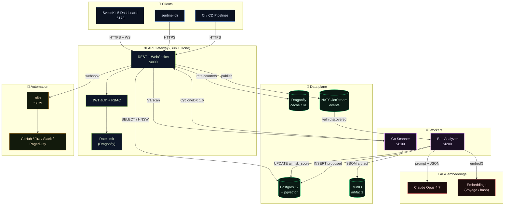
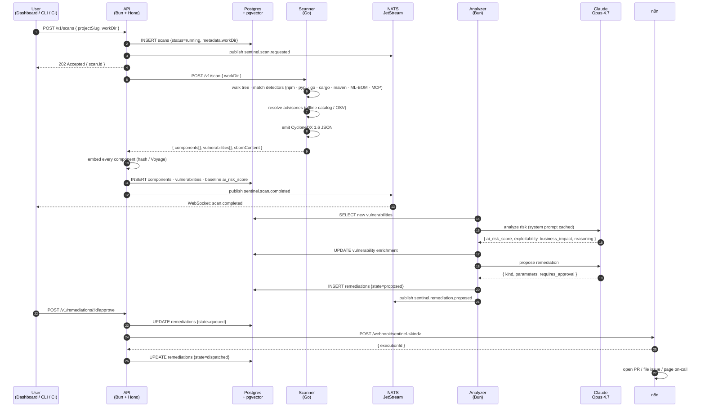
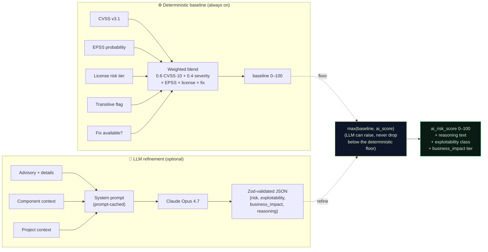
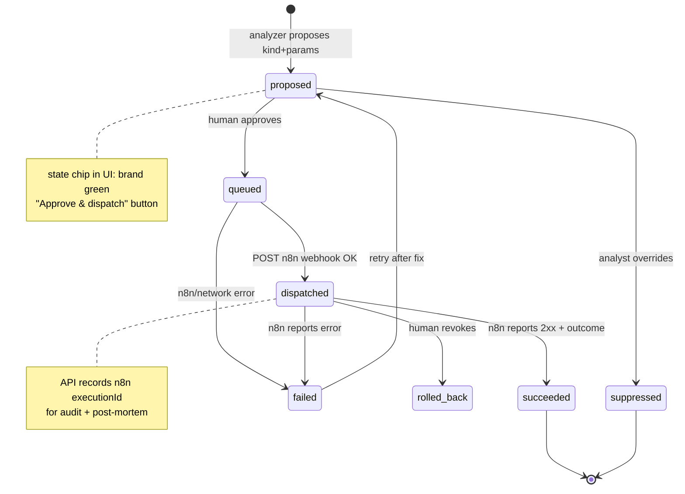
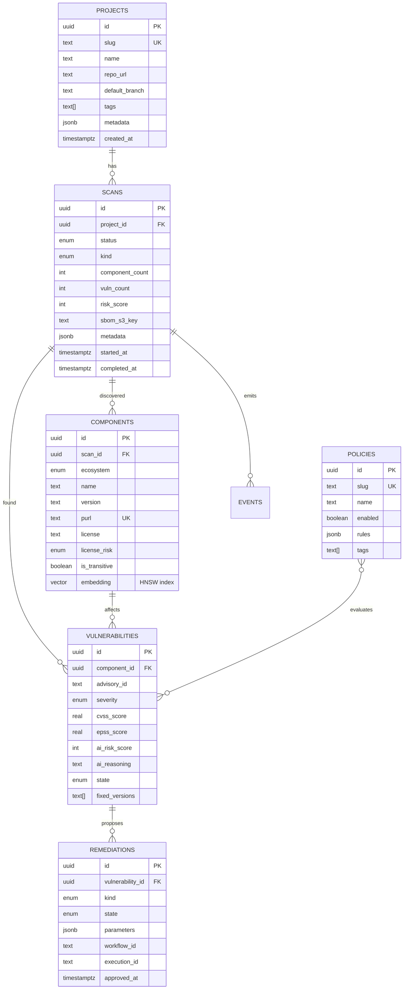
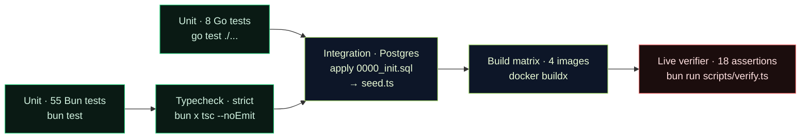
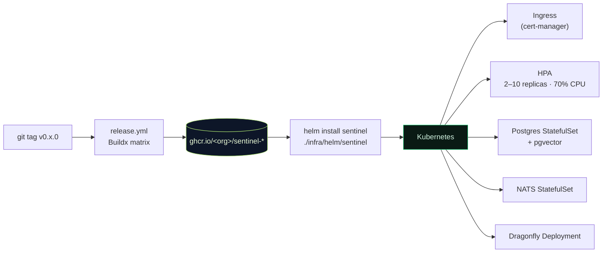

<h1 align="center">Sentinel</h1>

<p align="center">
  <strong>AI-native software supply chain security with autonomous remediation.</strong><br/>
  Scan, reason, decide, dispatch &mdash; in one governed pipeline.
</p>

<p align="center">
  <a href="https://github.com/theNeuralHorizon/sentinel/actions/workflows/ci.yml"></a>
  <a href="https://github.com/theNeuralHorizon/sentinel/actions/workflows/security.yml"></a>
  <a href="LICENSE"></a>
  
  
  
  
  
  
</p>

---

## Table of contents

- [Why Sentinel](#why-sentinel)
- [What Sentinel does](#what-sentinel-does)
- [System architecture](#system-architecture)
- [How a scan flows end-to-end](#how-a-scan-flows-end-to-end)
- [AI risk enrichment pipeline](#ai-risk-enrichment-pipeline)
- [Remediation approval lifecycle](#remediation-approval-lifecycle)
- [Data model](#data-model)
- [Tech stack](#tech-stack)
- [Feature matrix](#feature-matrix)
- [Quickstart (5 minutes)](#quickstart-5-minutes)
- [Testing & verification](#testing--verification)
- [Deploying to production](#deploying-to-production)
- [Repo layout](#repo-layout)
- [Development](#development)
- [Roadmap & status](#roadmap--status)
- [Documentation index](#documentation-index)
- [License & sources](#license--sources)

---

## Why Sentinel

| Pain in 2026 | Concrete evidence | Sentinel's answer |
|---|---|---|
| Enterprises can't see their AI/ML supply chain | [62% of security teams have no visibility into where LLMs run](https://venturebeat.com/security/seven-steps-to-ai-supply-chain-visibility) | First-class detectors for HuggingFace models, datasets, MCP servers; ML-BOM in CycloneDX 1.6 |
| Regulation is no longer optional | [EU Cyber Resilience Act (2027) + US EO 14028 / EO 14144](https://www.perforce.com/blog/alm/executive-order-14028-compliance) | Signed SBOMs + attestations in CI; auditable policy engine |
| CVE tools flood teams with low-signal alerts | Thousands of findings → no business context | LLM-powered re-ranking (CVSS × EPSS × license × reachability × fix availability) |
| License compliance across transitive deps is manual | [Sonatype 2026 State of Supply Chain](https://www.sonatype.com/state-of-the-software-supply-chain/2026/software-compliance) | Classifier + 20-license matrix + declarative policies (`block AGPL`, `escalate SSPL`, …) |
| Remediation is glue code nobody wants to own | Every team writes its own PR/Jira/Slack bot | Agentic dispatch through n8n — **500+ prebuilt integrations** |

---

## What Sentinel does

1. **Multi-ecosystem scanning** &mdash; npm, PyPI, Go modules, Cargo, Maven, containers, HuggingFace models, datasets, **and MCP servers** (CycloneDX 1.6 + SPDX 3.0 AI profile).
2. **Business-aware risk scoring** &mdash; Claude Opus 4.7 reasons over CVSS, EPSS, license risk, transitive flags and fix availability, with a deterministic fallback so the system works offline.
3. **Vector-indexed provenance** &mdash; pgvector HNSW answers *"what else is affected by something like log4shell?"* in milliseconds.
4. **Agentic remediation** &mdash; n8n workflows open PRs, file tickets, rotate tokens, or page on-call based on the risk class and your policies.
5. **Natural-language queries** &mdash; *"what's my exposure to CVE-2024-xxxx?"* &rarr; instant answer grounded in your live SBOM graph.
6. **Drift monitoring** &mdash; every release emits a signed SBOM; Sentinel diffs them so regressions surface before they hit production.

---

## System architecture



**What this shows.** Five stateless services behind one API gateway, three stateful data services, two optional AI providers, and one pluggable automation layer. Every box is horizontally scalable except the databases; every inter-service hop is observable (OpenTelemetry) and auditable (append-only `events` table).

---

## How a scan flows end-to-end



---

## AI risk enrichment pipeline

Every vulnerability goes through a two-stage pipeline. The deterministic baseline always runs; the LLM stage is optional.



**Safety property.** The LLM can only raise the score, never drop it below the deterministic floor. A compromised or prompt-injected model cannot mark a critical CVE as low-risk ([docs/AI_SECURITY.md](docs/AI_SECURITY.md)).

---

## Remediation approval lifecycle



**Approval by default, autonomy by policy.** Every remediation starts in `proposed`; a human clicks Approve to advance. Policies can mark specific kinds (e.g. `notify_slack` for low-severity info) as auto-approved.

---

## Data model



Every arrow is a `FOREIGN KEY ... ON DELETE CASCADE`. Every `jsonb` field has a corresponding Zod schema in `packages/shared/src/`. pgvector's HNSW index on `components.embedding` keeps similarity queries sub-millisecond up to hundreds of millions of rows.

---

## Tech stack

### Runtime & language

| Layer | Tech | Version | Why |
|---|---|---|---|
| API runtime | **Bun** | 1.3 | ~3× Node's HTTP throughput · native TypeScript · zero build step · Hono on Bun does **130k+ req/s** |
| API framework | **Hono** | 4.12 | Edge-ready (also runs on Cloudflare Workers, Deno) · tiny core, strict TypeScript |
| Scanner | **Go** | 1.22 | Whole SBOM ecosystem is Go (syft, grype, osv-scanner, Trivy, cosign) · 10 MB static binary |
| Frontend | **SvelteKit 5** | 2.8 | Runes for fine-grained reactivity · adapter-node for Bun-served SSR |
| Styling | **Tailwind v4** | alpha | CSS-first `@theme` tokens · OKLCH colour space · no JS config file |

### Data plane

| Store | Tech | Why |
|---|---|---|
| Relational + vectors | **Postgres 17 + pgvector** | Transactional consistency between components and their embeddings; HNSW is fast enough for hundreds of millions of rows |
| Cache / rate limit | **Dragonfly** | 25× Redis throughput on the same wire protocol · snapshot-based persistence |
| Events | **NATS JetStream** | Lightweight at-least-once · cleanly audited per-subject · survives broker restarts |
| Object storage | **MinIO** | S3-compatible · optional but simplifies artifact capture (SBOM JSON, logs) |

### AI

| Component | Tech | Fallback |
|---|---|---|
| Risk reasoning | **Claude Opus 4.7** (Anthropic SDK) | `computeBaselineRisk` — deterministic weighted formula |
| Remediation planning | **Claude Opus 4.7** | Rule-based (`pr_bump` if fix exists, else `issue_ticket`) |
| NL query planning | **Claude Opus 4.7** | Regex router (`CVE-*` / `GHSA-*` / `"exposure to X"`) |
| Embeddings | **Voyage-3-large** (configurable) | **`hashToVector`** deterministic L2-normalised hash (works offline) |

> **Important.** Nothing is "trained" — Sentinel is a pure consumer of a hosted LLM. The deterministic fallbacks mean the whole platform runs fully offline with zero external dependencies. See [docs/AI_SECURITY.md](docs/AI_SECURITY.md) for OWASP-LLM Top-10 mapping.

### Type system & validation

| Concern | Library |
|---|---|
| ORM & migrations | **Drizzle ORM** — zero-overhead, type-safe, serverless-friendly |
| Schema validation | **Zod** — used everywhere data crosses a boundary |
| LLM output | Claude &rarr; `extractJson` &rarr; Zod parse (never blind-trusted) |

### Automation & delivery

| Concern | Tech |
|---|---|
| Workflow engine | **n8n** — 500+ integrations, self-hostable, visual editor for security team |
| Container | Multi-stage Dockerfiles (Bun-alpine / Go-alpine), non-root, read-only rootfs, dropped caps |
| Orchestration | Docker Compose for local · **Kubernetes** manifests + **Helm** chart for prod |
| CI | GitHub Actions — lint, typecheck, Bun tests, Go tests, Postgres integration, 4-image matrix build |
| Security CI | gitleaks · Trivy FS · OSV-Scanner · CodeQL (Go + TS) · Syft SBOM + `actions/attest-sbom` |
| Release | Signed multi-arch images, cosign provenance + SBOM attestation |

---

## Feature matrix

| Feature | Status | Where |
|---|---|---|
| npm / pypi / go / cargo / maven detectors | ✅ Shipping | `apps/scanner/internal/scan/detectors*.go` |
| HuggingFace model / dataset detector | ✅ Shipping | `detectors.go::mlModelDetector` |
| MCP server detector (`.mcp.json`) | ✅ Shipping | `detectors.go::mcpDetector` |
| CycloneDX 1.6 SBOM output | ✅ Shipping | `cyclonedx.go` |
| SPDX 3.0 output | 🟡 Roadmap v0.2 | — |
| Deterministic baseline risk | ✅ Shipping | `packages/shared/src/risk.ts` |
| Claude-refined risk score | ✅ Shipping | `packages/ai/src/risk.ts` |
| pgvector semantic search | ✅ Shipping | `apps/api/src/routes/search.ts` |
| Natural-language query planner | ✅ Shipping | `apps/api/src/routes/nl-query.ts` |
| Declarative policy engine | ✅ Shipping | `packages/shared/src/policy.ts` |
| Policy dry-run (`/v1/policy-eval`) | ✅ Shipping | `apps/api/src/routes/policy-eval.ts` |
| Full per-scan policy audit | ✅ Shipping | `policy-eval.ts::/scan` |
| n8n workflow dispatch | ✅ Shipping | `apps/api/src/services/n8n.ts` |
| Live WebSocket activity feed | ✅ Shipping | `apps/api/src/services/ws-hub.ts` |
| Drift diff (CLI + API) | ✅ Shipping | `apps/cli/src/commands/diff.ts` |
| `sentinel-cli scan / diff / export` | ✅ Shipping | `apps/cli/` |
| Helm chart + K8s manifests | ✅ Shipping | `infra/helm/` · `infra/k8s/` |
| OIDC / SAML SSO | 🟡 Roadmap v0.3 | — |
| Tenant-scoped RBAC + audit export | 🟡 Roadmap v0.3 | — |
| Live OSV mirror (replacing built-in catalog) | 🟡 Roadmap v0.2 | — |

✅ = shipping and in CI · 🟡 = planned · see [docs/ROADMAP.md](docs/ROADMAP.md).

---

## Quickstart (5 minutes)

**Prerequisites:** Docker 24+, Bun 1.3, (optional) an Anthropic API key.

```bash
# 1. Clone and configure
git clone https://github.com/theNeuralHorizon/sentinel
cd sentinel
cp .env.example .env
# Optional: add ANTHROPIC_API_KEY=sk-ant-... to .env

# 2. Bring up the full stack (Postgres, Dragonfly, NATS, MinIO, n8n, scanner, analyzer, api, web, otel)
docker compose up -d

# 3. Apply the schema (first run only) + seed demo data
docker compose exec -T postgres psql -U sentinel -d sentinel \
  < packages/db/migrations/0000_init.sql
docker compose exec -T api bun run //app/scripts/seed.ts

# 4. Verify the whole stack end-to-end (18 live assertions)
bun run scripts/verify.ts

# 5. Open the dashboard
open http://localhost:5173
```

You should see a populated dashboard with 3 projects, 4 real CVEs, an AI supply chain card tracking models + MCP servers, and a pulsing live activity feed.

Full walkthrough: [docs/QUICKSTART.md](docs/QUICKSTART.md). Demo script: [docs/DEMO.md](docs/DEMO.md).

---

## Testing & verification

Sentinel ships three layers of verification. All three must pass before a PR can merge.



### Unit + integration (local)

```bash
bun test                              # 55 Bun tests
cd apps/scanner && go test ./...      # 8 Go tests
(cd apps/api && bun x tsc --noEmit)   # strict typecheck
```

### Live end-to-end (against the running stack)

```bash
bun run scripts/verify.ts
```

Prints a coloured table of 18 assertions covering liveness, auth, data plane, risk engine, policy engine, pgvector similarity, NL query routing and scanner reachability. Exits non-zero on any failure — drop-in for deploy gates.

### CI (GitHub Actions)

- `ci.yml` — lint + typecheck + unit tests + integration (live Postgres service) + 4-image build matrix
- `security.yml` — gitleaks + Trivy FS + OSV-Scanner + CodeQL (Go + TS/JS) + SBOM attestation
- `release.yml` — on `v*.*.*` tags: build 4 images, push to GHCR with cosign provenance + SBOM, cut GitHub release with auto-generated notes

---

## Deploying to production



Every image ships with **cosign provenance + SBOM attestation**. See [docs/DEPLOYMENT.md](docs/DEPLOYMENT.md) for air-gapped deploys, backup scripts, and the production hardening checklist.

---

## Repo layout

```
sentinel/
├── apps/
│   ├── api/          Bun + Hono gateway — REST + WebSocket, JWT auth, rate limit
│   ├── analyzer/     Bun worker — Claude-powered risk + remediation planner
│   ├── scanner/      Go service — multi-ecosystem SBOM generation
│   ├── cli/          Bun CLI — sentinel-cli scan | diff | export
│   └── web/          SvelteKit 5 + Tailwind v4 — live dashboard
├── packages/
│   ├── db/           Drizzle schema + migrations
│   ├── shared/       Zod schemas · risk formula · license matrix · purl
│   └── ai/           Claude SDK wrapper · prompts · embedders
├── infra/
│   ├── docker/       Dockerfiles · compose overrides · otel-collector config
│   ├── k8s/          Kustomize manifests (namespace, statefulset, deployment, ingress, HPA)
│   ├── helm/         Helm chart (Chart.yaml, values.yaml, templates/)
│   └── n8n/          Remediation workflow templates (pr-bump, issue-ticket, notify-slack, escalate-oncall)
├── .github/
│   └── workflows/    ci.yml · security.yml · release.yml + Dependabot
├── docs/             12 markdown docs (architecture, API, policies, deploy, AI-security, …)
├── scripts/          seed.ts · verify.ts · smoke.sh
├── docker-compose.yml
├── CLAUDE.md         Guidance for AI agents contributing
└── README.md
```

---

## Development

```bash
# Install everything (workspace-aware)
bun install

# Run each service in its own terminal
bun --cwd apps/api      dev    # API on :4000
bun --cwd apps/analyzer dev    # Analyzer on :4200
bun --cwd apps/web      dev    # Web on :5173
cd apps/scanner && go run ./cmd/scanner   # Go scanner on :4100
```

Preferred loop is **HMR on the web + Docker for everything else**: `docker compose up -d postgres dragonfly nats minio n8n otel-collector scanner analyzer api` then `bun --cwd apps/web dev` locally.

**Agent contributions:** see [CLAUDE.md](CLAUDE.md) for hard rules (don't bypass JWT, update all 4 enum locations together, etc.) and [CONTRIBUTING.md](CONTRIBUTING.md) for the human version.

---

## Roadmap & status

- **v0.1.x (now)** — everything above, shipping with 63 tests + full CI
- **v0.2** — syft library integration · Cargo/Maven/container scanners · live OSV mirror · Voyage-3 embedder · SPDX 3.0 export
- **v0.3** — OIDC/SAML · multi-tenant RBAC · audit log export (SIEM-ready) · Slack app with interactive approvals
- **v0.4** — confidence-gated auto-dispatch · outcome learning · drift budgets

Full detail in [docs/ROADMAP.md](docs/ROADMAP.md). Everything we deliberately chose **not** to build is listed there too.

---

## Documentation index

| Doc | What it covers |
|---|---|
| [QUICKSTART](docs/QUICKSTART.md) | 5-minute local bring-up |
| [ARCHITECTURE](docs/ARCHITECTURE.md) | Every service, every data flow, every design decision |
| [API](docs/API.md) | Full REST + WebSocket reference |
| [POLICIES](docs/POLICIES.md) | Authoring declarative governance rules |
| [DEPLOYMENT](docs/DEPLOYMENT.md) | Kubernetes, Helm, hardening, backups, air-gapped |
| [DEPLOY_VERCEL_RENDER](docs/DEPLOY_VERCEL_RENDER.md) | One-click public-cloud deploy via `render.yaml` + `vercel.json` |
| [AI_SECURITY](docs/AI_SECURITY.md) | OWASP LLM Top-10 coverage + threat model |
| [BENCHMARKS](docs/BENCHMARKS.md) | Numbers + reproduction commands |
| [FAQ](docs/FAQ.md) | Stack choices, ownership, compliance, performance |
| [RESEARCH](docs/RESEARCH.md) | The 2026 industry context driving this |
| [ROADMAP](docs/ROADMAP.md) | What's next, what's deliberately out of scope |
| [DEMO](docs/DEMO.md) | 10-minute buyer walkthrough script |
| [CLAUDE.md](CLAUDE.md) | Guidance for AI agents working on this repo |
| [CONTRIBUTING](CONTRIBUTING.md) | For human contributors |
| [SECURITY](SECURITY.md) | How to report vulnerabilities |
| [CHANGELOG](CHANGELOG.md) | Per-release notes |

---

## License & sources

**Apache-2.0.** See [LICENSE](LICENSE).

Grounded in the following 2026 industry work:

- Cloudsmith — [The 2026 Guide to Software Supply Chain Security: From Static SBOMs to Agentic Governance](https://cloudsmith.com/blog/the-2026-guide-to-software-supply-chain-security-from-static-sboms-to-agentic-governance)
- Sonatype — [2026 State of the Software Supply Chain](https://www.sonatype.com/state-of-the-software-supply-chain/2026/software-compliance)
- OpenSSF — [Software Supply Chain Security WG](https://openssf.org/tag/software-supply-chain-security/)
- Anchore — [Syft & Grype](https://anchore.com/opensource/)
- Netrise — [What EO 14028, EU CRA, and NIST CSF 2.0 Mean](https://www.netrise.io/xiot-security-blog/what-eo-14028-eu-cra-and-nist-csf-2.0-mean-for-software-supply-chain-transparency)
- VentureBeat — [Seven steps to AI supply chain visibility](https://venturebeat.com/security/seven-steps-to-ai-supply-chain-visibility)
- NIST — AI Risk Management Framework (AI-BOM / ML-BOM)

<p align="center"><sub>Built by <a href="https://github.com/theNeuralHorizon">theNeuralHorizon</a> · Powered by <a href="https://bun.sh">Bun</a>, <a href="https://svelte.dev">Svelte 5</a>, <a href="https://www.postgresql.org/">Postgres 17</a>, <a href="https://github.com/pgvector/pgvector">pgvector</a>, <a href="https://claude.ai">Claude Opus</a>, <a href="https://n8n.io">n8n</a>.</sub></p>
